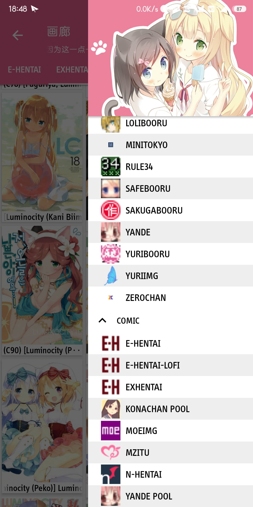

# MoeViewerR

订阅式的漫画阅读应用，可支持Exhentai，以及Yande、SankakuComplex等绝大多数Booru图库。

默认订阅源除少数站点外均不需要梯子，安装并订阅站点后即可食用。

## Requirement
Android 5.1 (SDK 22) 或更高版本

## Usage
- 安装 MoeViewerR

- 添加订阅  
  ```
  https://cdn.jsdelivr.net/gh/tsukiseele/MoeViewerR/packs/default_package.zip 
  ```
    
- 开始食用

## License
- 参见 [LICENSE](./LICENSE)

## Sample
{:width="200px"}
